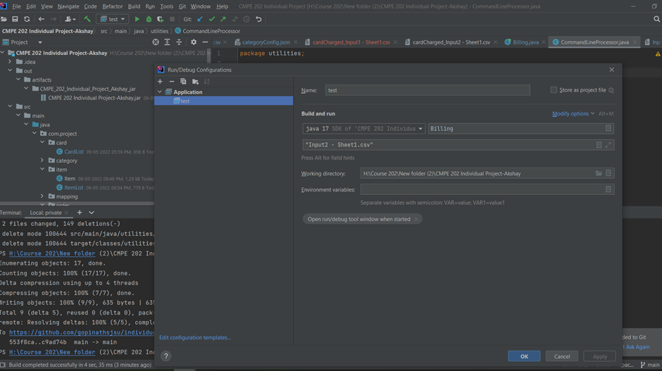
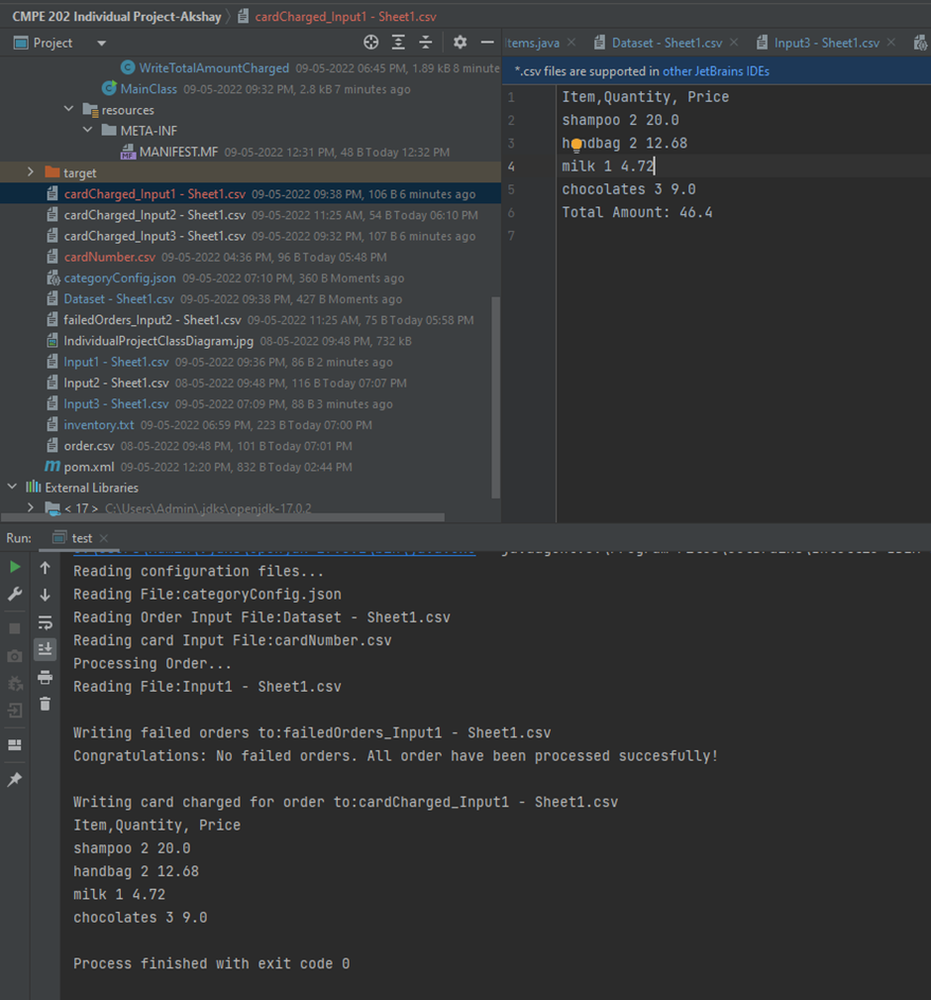
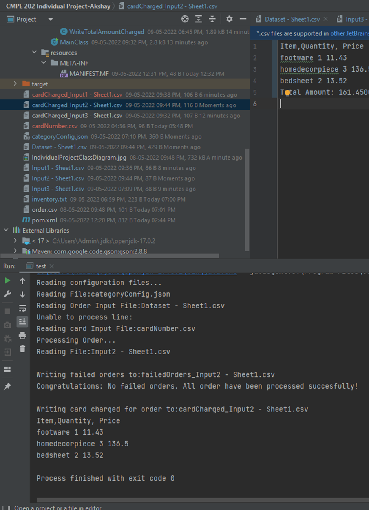
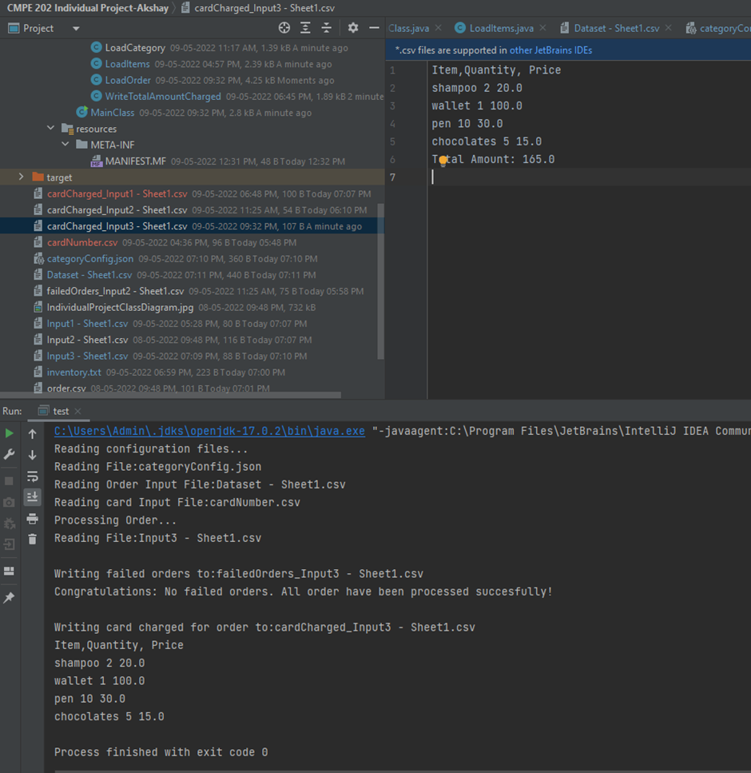
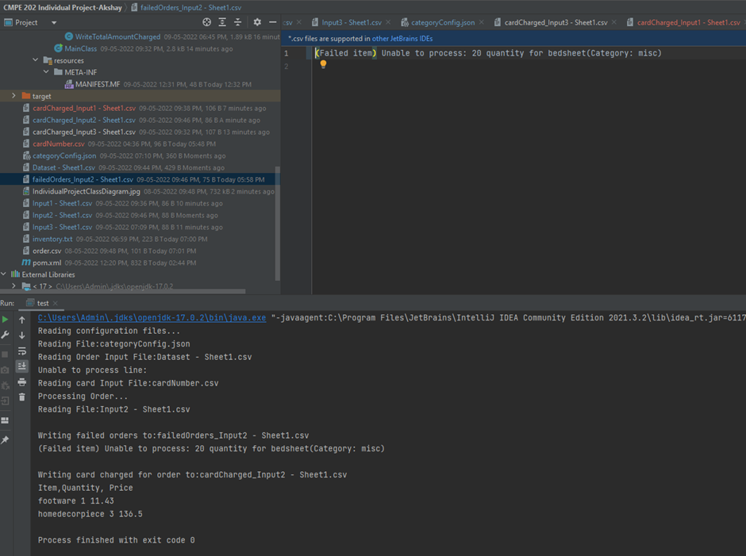
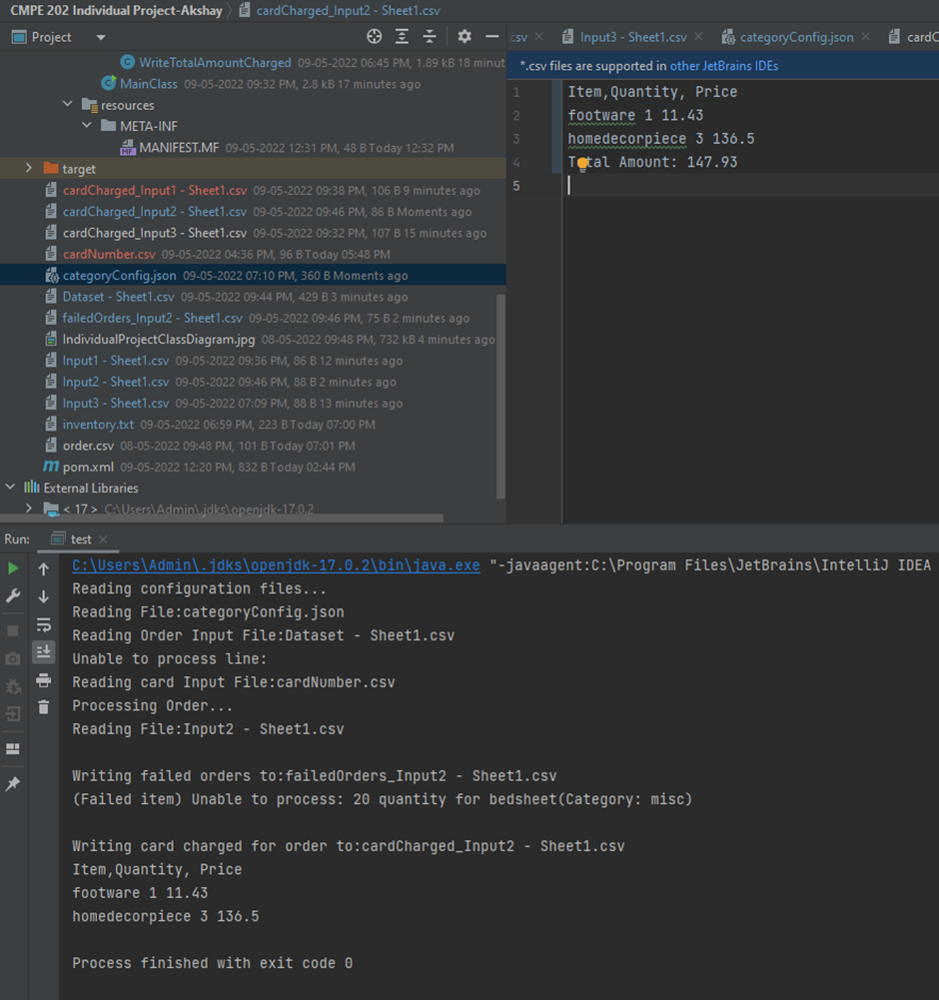
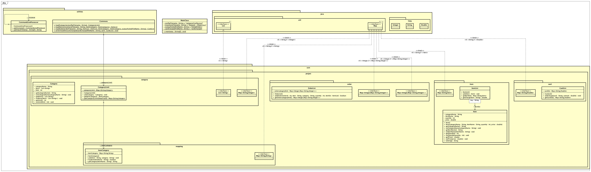

INSTRUCTIONS TO RUN PROGRAM:

1. Clone the project / Download the jar file – CMPE\_202\_Individual\_Project\_Akshay.jar in the home location
   (If running jar file)
2. Run the command: java -cp CMPE\_202\_Individual\_Project\_Akshay.jar Billing INPUT FILENAME 3. **Sample Input** : java -cp CMPE\_202\_Individual\_Project\_Akshay.jar Billing &quot;Input1 - Sheet1.csv&quot;

(If Cloning repo and running)

Select Run, Edit configuration, provide the input file as shown below, okay, click run button (green play kind of icon)

3. Failed orders are written to a newly generated file failedOrders\_INPUT FILE NAME
4. Upon successful completion, the card charged data is written to newly generated cardCharged\_INPUT FILE NAME
5. The output is visible in the terminal as well.

**Problem Statement:**

Design and implement a Java application for the following requirements. You may choose up to 3 design patterns. Include a class diagram for your design. All submissions should be committed to the assigned Github repo. Please include a README file with very clear instructions on how to build and run your application.

Please make sure that the name of the main class of your project is &#39;Billing&#39;

**Requirements:**

The application should maintain an internal, static database (inventory of stock) (this may be developed using HashMaps and/or other built-in Java Data structures). This means once we re-run the program, the changes to the data would not persist. We will provide the data that has to be maintained. The data will contain the following tables and fields:

(Sample input file and sample data set for the inventory would be provided separately)
Table 1: Items

- Category (Essentials, Luxury, Miscellaneous)
- Item for each category (Essentials - Clothes, soap, milk; Luxury - perfume, chocolates; Misc - Bedsheets, footwear)
- The available Quantity of each item
- Price of each item

**Table 2:** Cards

- Card Numbers

2. Input CSV file will contain an order including Items, Quantity needed, and the payment card number.

3. Input file should be processed as follows:

- Validate if the requested quantity for each item is permissible. For example, if the request is to order 3 soaps, check the database if we have at least 3 soaps in our inventory.
- There will be a cap on the quantity of each category that can be ordered in one single order. For example, restrict Essentials to a maximum of 3, Luxury to 4, and Misc to 6. (This will be configured beforehand)
- In case it is an incorrect request, generate and output TXT file with message &quot;Please correct quantities.&quot; and include the items with incorrect quantities
- After this validation, if the cart is valid, calculate prices for the cart.
- Take the card number of the user and if it is not present in DB add it.
- Output the CSV list with the total amount paid.

**Design Patterns Used:**

1. Chain of responsibility pattern

- Chain of responsibility Is a behavioral pattern that lets you pass requests along a chain of handlers
- It relies on transforming particular behavior into stand alone objects called handlers, in our case the functionality to process orders with a chain of handlers (for example, reading the input file, mapping each category with item list, check if order quantity is exceeding the individual item limit, followed by checking if it exceeds category limit, then based on this generate order placement - success or failure output)

1. Iterator Pattern
- **Iterator**  is a behavioral design pattern that lets you traverse elements of a collection without exposing its underlying representation
- For the functionality to take item for each category and map it with item list

1. Singleton Pattern
- **Singleton**  is a creational design pattern that lets you ensure that a class has only one instance, while providing a global access point to this instance.
- For the functionality of reading input file from command line

Cap Limits Provided: Luxury: 3, Essentials : 5, Misc : 6

Output Snapshots

1. Input File 1

## **The Order is successfully placed. No failed order file is generated.**

2. Input File 2

Order placement is successful. No failed order file is generated.

3. Input file 3

Order placement is successful. No failed order file is generated.

4. Error File

The order quantity for **Bedsheet** is more than the limit, so order placement fails for the item with exceeding quantity, whereas card will be charged for other items in the cart

5. Cart File

Class Diagram for Individual Project.

